# 💻 Laboratorio 3 - DOSW-02

---

## 👥 Integrantes

- Maria Belén
- Juan Pablo Contreras
- Nikolas Martinez

---

## 📸 Evidencia de Commits

---

## 🚀 Evidencias de Desarrollo

### 🔐 Reto 1 - Sistema Bancario Simulado

---

## 📜 Reglas de Negocio

1. ✅ Los números de cuenta deben tener exactamente **10 dígitos**.
2. 🏦 Los **dos primeros dígitos** deben corresponder a un banco registrado:
    - `01` → **Bancolombia**
    - `02` → **Davivienda**
3. 🚫 Los saldos **no pueden ser negativos**.
4. 🔍 Solo se permiten **consultas y depósitos** en cuentas **creadas y validadas**.
5. 🔢 Los números de cuenta **no pueden contener letras ni caracteres especiales**.

---

## ⚙️ Funcionalidades Principales

### 🏦 1. Gestión de Cuentas
- Crear una cuenta bancaria (validando el número).
- Validar la existencia y formato de la cuenta.

### 💰 2. Servicios Financieros Básicos
- Consultar el saldo de una cuenta.
- Realizar un depósito en una cuenta existente.

### 🔒 3. Seguridad y Calidad del Código
- Implementación con **pruebas automatizadas**.
- Validación de reglas de negocio en **cada operación**.

---

## 🎭 Actores Principales

- 👤 Clientes
- 🖥️ Sistema Bankify
- 🏦 Bancos Asociados
- ⚙️ Sistema

---

## ⚠️ Precondiciones del Sistema

- Tener bancos asociados a Bankify.
- Disponer de un sistema que **automatice la generación** de números de cuenta.
- Contar con un medio para la **verificación de datos del usuario**.

---

### 💳 Reto 2 - Diseñando

## 📜 Historias de Usuario

**Cliente**
- Modificar datos de usuario:
    Como cliente quiero modificar mis datos de usuario (nombre, dirección, télefono, documento, etc) para poder mantener mi información personal actualizada.

- Gestionar cuentas bancarias:
    Como cliente quiero gestionar mis cuentas bancarias para llevar mejor mis finanzas personales.

- Gestionar servicios financieros:
    Como cliente quiero gestionar servicios financieros para poder mandarle plata a mi abuelita.

**Bancos**
- Consultar cuentas de usuarios:
    Como banco quiero consultar cuentas de usuarios para poder reconocer posibles casos de deuda o abonanza.

- Consultar  transacciones realizadas:
    Como banco quiero consultar transacciones realizadas para poder reconocer posibles casos de fraude.

**Sistema Bankify**
- Gestionar clientes:
    Como Bankify quiero gestionar clientes para poder tener una base de datos actualizada.

- Gestionar los bancos asociados:
    Como Bankify quiero gestionar los bancos asociados para mantener actualizada la información de las entidades bancarias con las que trabaja el sistema.

- Consultar transacciones:
    Como Bankify quiero consultar transacciones para poder monitorear posibles casos de fraude.

### 💳 Reto 2 - Diseñando

## 📜 Historias de Usuario

**Cliente**
- Modificar datos de usuario:
    Como cliente quiero modificar mis datos de usuario (nombre, dirección, télefono, documento, etc) para poder mantener mi información personal actualizada.

- Gestionar cuentas bancarias:
    Como cliente quiero gestionar mis cuentas bancarias para llevar mejor mis finanzas personales.

- Gestionar servicios financieros:
    Como cliente quiero gestionar servicios financieros para poder mandarle plata a mi abuelita.

**Bancos**
- Consultar cuentas de usuarios:
    Como banco quiero consultar cuentas de usuarios para poder reconocer posibles casos de deuda o abonanza.

- Consultar  transacciones realizadas:
    Como banco quiero consultar transacciones realizadas para poder reconocer posibles casos de fraude.

**Sistema Bankify**
- Gestionar clientes:
    Como Bankify quiero gestionar clientes para poder tener una base de datos actualizada.

- Gestionar los bancos asociados:
    Como Bankify quiero gestionar los bancos asociados para mantener actualizada la información de las entidades bancarias con las que trabaja el sistema.

- Consultar transacciones:
    Como Bankify quiero consultar transacciones para poder monitorear posibles casos de fraude.

## 📸 Diagrama de Contexto

## Diagrama de Casos de Uso

## Diagrma de Clases

## Excel

# 🃏 Reto 3 - Planning Poker

Este programa en Java implementa una simulación básica de **Planning Poker**, técnica utilizada en metodologías ágiles para estimar el esfuerzo de historias de usuario en un equipo de desarrollo.

## 🚀 Descripción

- El usuario ingresa un conjunto de **historias de usuario**.
- Se define el número de **integrantes del equipo**.
- Cada integrante **vota** utilizando la **secuencia de Fibonacci** (1, 2, 3, 5, 8, 13).
- Si todos los votos son iguales, se logra el **consenso**.
- Si los votos divergen, se pide discutir y volver a votar.
- Finalmente, se genera un **resumen con las estimaciones finales** de cada historia.

---

## 📐 Principios de Diseño Utilizados

### ✅ Principio de Responsabilidad Única (SRP)
Cada parte del código tiene una única responsabilidad:
- Lectura de entradas del usuario.
- Validación de votos.
- Verificación del consenso.
- Impresión del resumen.

---

### ✅ Principio de Abierto/Cerrado (OCP)
El uso de la **lista de Fibonacci** (`List<Integer> fibonacci = Arrays.asList(1, 2, 3, 5, 8, 13);`) facilita modificar o ampliar los valores permitidos sin necesidad de reestructurar la lógica principal.
 
---

## 🎭 Patrones de Diseño Utilizados

### 🔹 Patrón **Iterator**
Se utiliza al recorrer listas (`for (String historia : historias)` y `for (Map.Entry<String, Integer> e : estimaciones.entrySet())`) para acceder a los elementos de manera uniforme sin exponer su implementación interna.

## 📸 Evidencia

---

# 🏃🏼‍♂️ Reto 5 - Corran que ahí viene el JaCOCO

## 🔄 Actualización del pom.xml
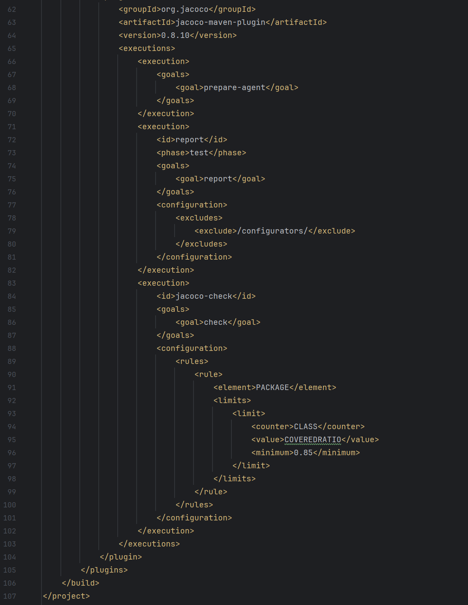

Al ejecutar el comando **mvn clean install**, salía el mensaje de "FAILED BUILD" debido a que la cobertura de los test no llegaba al mínimo requerido
### 📸 Evidencia
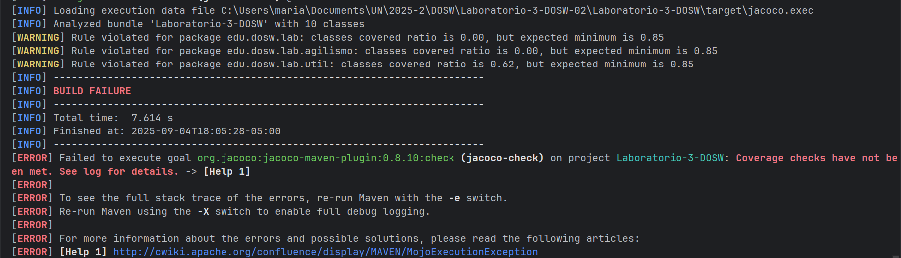

Viendo el archivo .html generado por JaCOCO, se obtuvieron los siguientes resultados:
- Cobertura de instrucciones: 22% (375 de 482 instrucciones no fueron cubiertas).
- Cobertura de ramas: 23% (20 de 26 ramas no fueron cubiertas).
Es relevante mencionar que tanto agilismo como lab arrojan 0% de cobertura porque el proyecto completo de Bankify se manejó en util

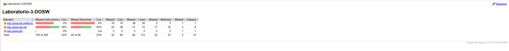

## 🔹 Mejorando la cobertura
Para mejorar la cobertura del proyecto, se crearon las clases BankifyTest y MovementTest. Se puede ver en la siguiente imagen que la cobertura de util ya supera el 85%

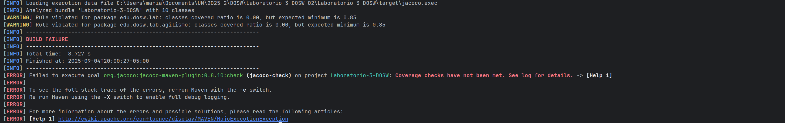

En sí, fue necesario añadir tests para comprobar que las reglas de negocio relacionadas con los montos, se cumplan. También se realizaron los tests correspondientes para verificar el funcionamiento de la clase "central" Bankify.

---

# 🐋 Reto 6 - SonarQube

## 📸 Evidencia con los pasos realizados
### 🔹 Descarga de la imagen, arranque del servicio y validación funcionamiento
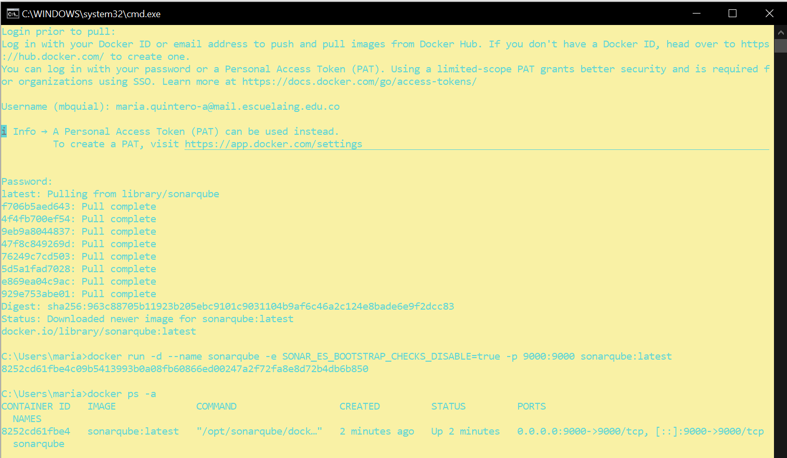

### 🔹 Instalación en el IDE
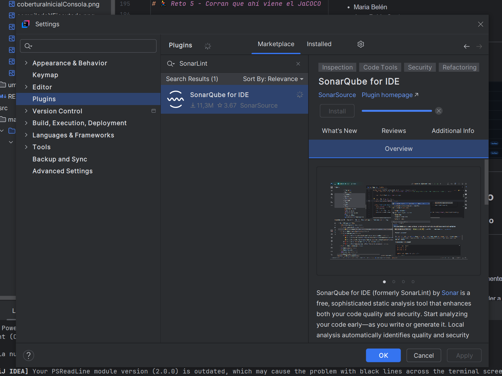

### 🔹 Cambios en el pom.xml
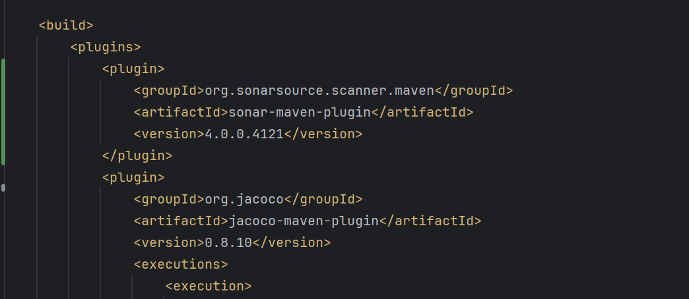
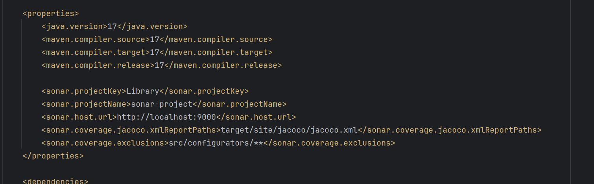

### 🔹 Resultados
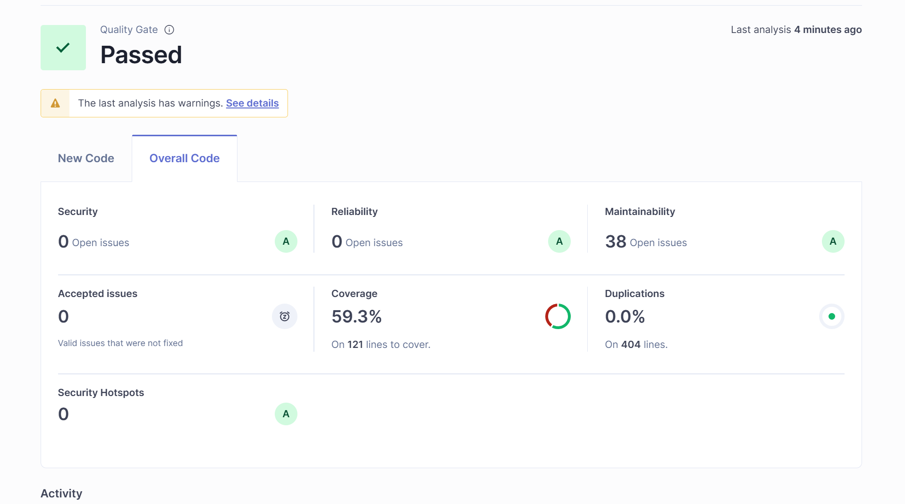
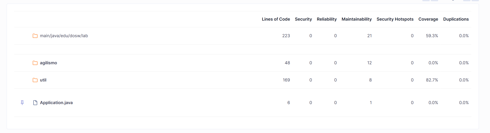
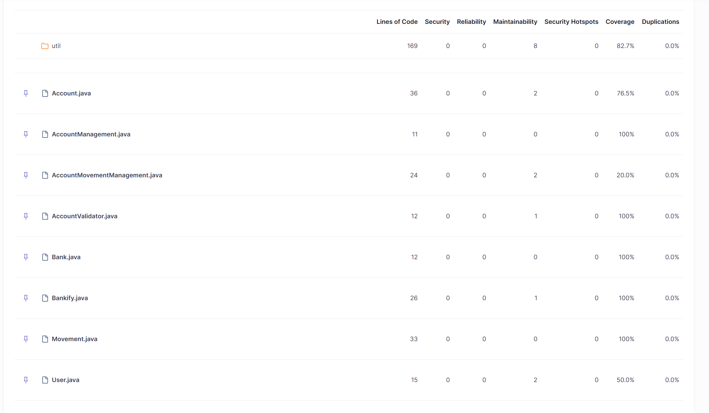