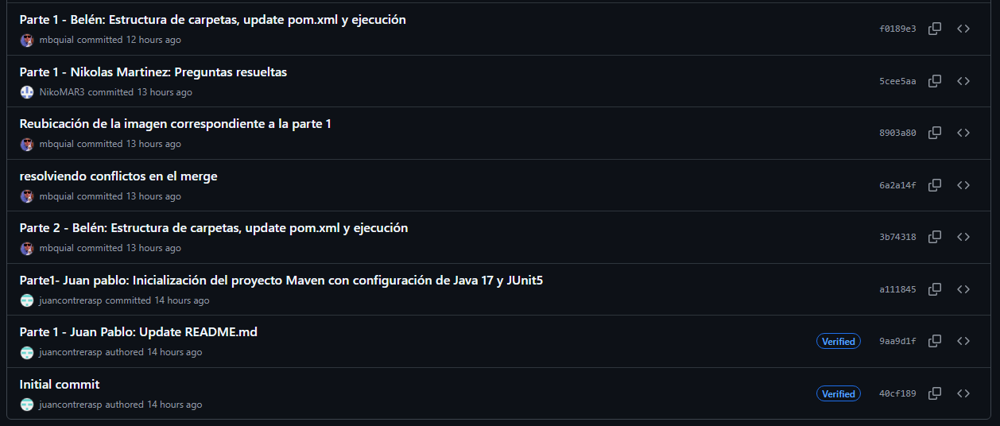
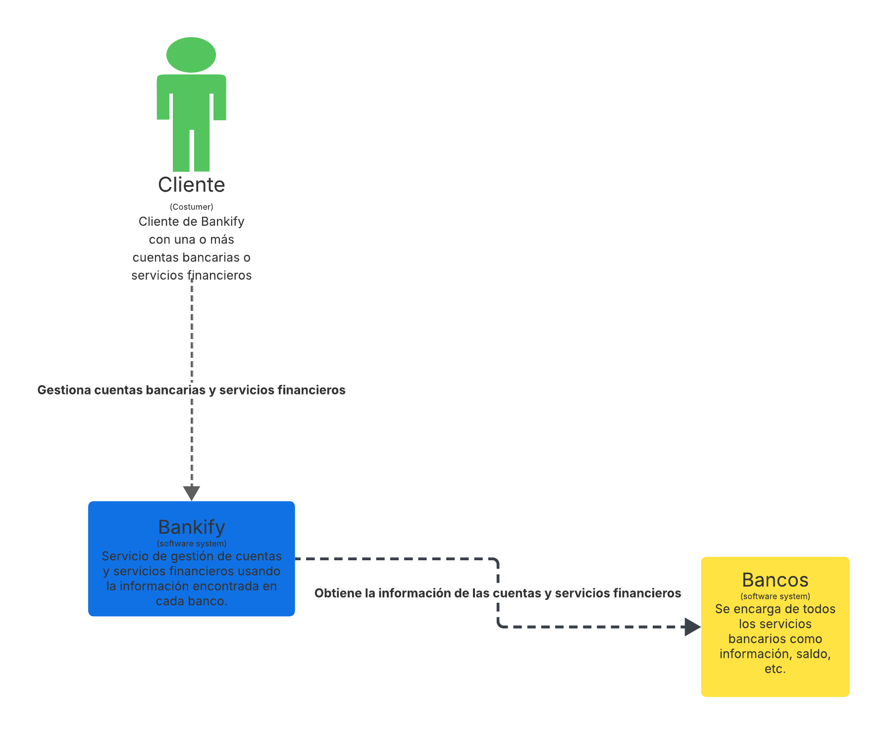
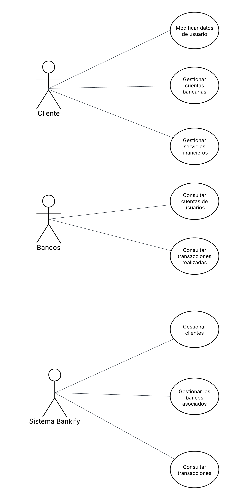
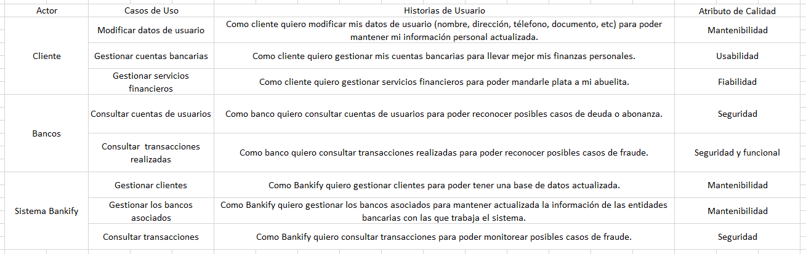
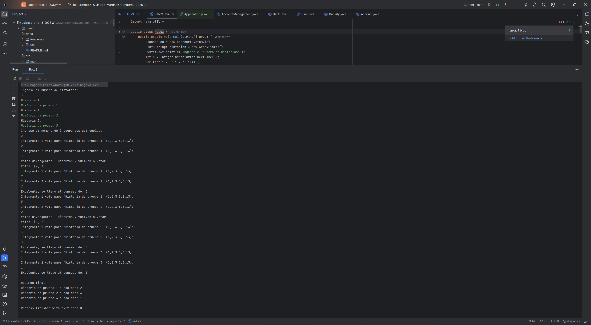
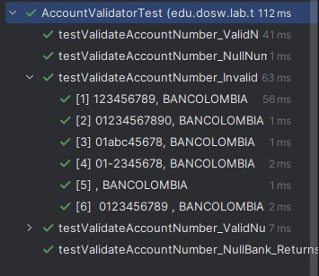
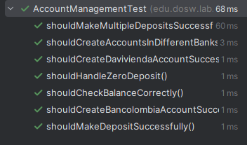

# 💻 Laboratorio 3 - DOSW-02

---

## 👥 Integrantes

- Maria Belén
- Juan Pablo Contreras
- Nikolas Martinez

---

## 📸 Evidencia de Commits

---

## 🚀 Evidencias de Desarrollo

### 🔐 Reto 1 - Sistema Bancario Simulado

---

## 📜 Reglas de Negocio

1. ✅ Los números de cuenta deben tener exactamente **10 dígitos**.
2. 🏦 Los **dos primeros dígitos** deben corresponder a un banco registrado:
    - `01` → **Bancolombia**
    - `02` → **Davivienda**
3. 🚫 Los saldos **no pueden ser negativos**.
4. 🔍 Solo se permiten **consultas y depósitos** en cuentas **creadas y validadas**.
5. 🔢 Los números de cuenta **no pueden contener letras ni caracteres especiales**.

---

## ⚙️ Funcionalidades Principales

### 🏦 1. Gestión de Cuentas
- Crear una cuenta bancaria (validando el número).
- Validar la existencia y formato de la cuenta.

### 💰 2. Servicios Financieros Básicos
- Consultar el saldo de una cuenta.
- Realizar un depósito en una cuenta existente.

### 🔒 3. Seguridad y Calidad del Código
- Implementación con **pruebas automatizadas**.
- Validación de reglas de negocio en **cada operación**.

---

## 🎭 Actores Principales

- 👤 Clientes
- 🖥️ Sistema Bankify
- 🏦 Bancos Asociados
- ⚙️ Sistema

---

## ⚠️ Precondiciones del Sistema

- Tener bancos asociados a Bankify.
- Disponer de un sistema que **automatice la generación** de números de cuenta.
- Contar con un medio para la **verificación de datos del usuario**.

---

### 💳 Reto 2 - Diseñando

## 📜 Historias de Usuario

**Cliente**
- Modificar datos de usuario:
    Como cliente quiero modificar mis datos de usuario (nombre, dirección, télefono, documento, etc) para poder mantener mi información personal actualizada.

- Gestionar cuentas bancarias:
    Como cliente quiero gestionar mis cuentas bancarias para llevar mejor mis finanzas personales.

- Gestionar servicios financieros:
    Como cliente quiero gestionar servicios financieros para poder mandarle plata a mi abuelita.

**Bancos**
- Consultar cuentas de usuarios:
    Como banco quiero consultar cuentas de usuarios para poder reconocer posibles casos de deuda o abonanza.

- Consultar  transacciones realizadas:
    Como banco quiero consultar transacciones realizadas para poder reconocer posibles casos de fraude.

**Sistema Bankify**
- Gestionar clientes:
    Como Bankify quiero gestionar clientes para poder tener una base de datos actualizada.

- Gestionar los bancos asociados:
    Como Bankify quiero gestionar los bancos asociados para mantener actualizada la información de las entidades bancarias con las que trabaja el sistema.

- Consultar transacciones:
    Como Bankify quiero consultar transacciones para poder monitorear posibles casos de fraude.

### 💳 Reto 2 - Diseñando

## 📜 Historias de Usuario

**Cliente**
- Modificar datos de usuario:
    Como cliente quiero modificar mis datos de usuario (nombre, dirección, télefono, documento, etc) para poder mantener mi información personal actualizada.

- Gestionar cuentas bancarias:
    Como cliente quiero gestionar mis cuentas bancarias para llevar mejor mis finanzas personales.

- Gestionar servicios financieros:
    Como cliente quiero gestionar servicios financieros para poder mandarle plata a mi abuelita.

**Bancos**
- Consultar cuentas de usuarios:
    Como banco quiero consultar cuentas de usuarios para poder reconocer posibles casos de deuda o abonanza.

- Consultar  transacciones realizadas:
    Como banco quiero consultar transacciones realizadas para poder reconocer posibles casos de fraude.

**Sistema Bankify**
- Gestionar clientes:
    Como Bankify quiero gestionar clientes para poder tener una base de datos actualizada.

- Gestionar los bancos asociados:
    Como Bankify quiero gestionar los bancos asociados para mantener actualizada la información de las entidades bancarias con las que trabaja el sistema.

- Consultar transacciones:
    Como Bankify quiero consultar transacciones para poder monitorear posibles casos de fraude.

## 📸 Diagrama de Contexto

## Diagrama de Casos de Uso

## Diagrma de Clases

## Excel

# Reto 3 - Planning Poker

Este programa en Java implementa una simulación básica de **Planning Poker**, técnica utilizada en metodologías ágiles para estimar el esfuerzo de historias de usuario en un equipo de desarrollo.

## 🚀 Descripción

- El usuario ingresa un conjunto de **historias de usuario**.
- Se define el número de **integrantes del equipo**.
- Cada integrante **vota** utilizando la **secuencia de Fibonacci** (1, 2, 3, 5, 8, 13).
- Si todos los votos son iguales, se logra el **consenso**.
- Si los votos divergen, se pide discutir y volver a votar.
- Finalmente, se genera un **resumen con las estimaciones finales** de cada historia.

---

## 📐 Principios de Diseño Utilizados

### ✅ Principio de Responsabilidad Única (SRP)
Cada parte del código tiene una única responsabilidad:
- Lectura de entradas del usuario.
- Validación de votos.
- Verificación del consenso.
- Impresión del resumen.

---

### ✅ Principio de Abierto/Cerrado (OCP)
El uso de la **lista de Fibonacci** (`List<Integer> fibonacci = Arrays.asList(1, 2, 3, 5, 8, 13);`) facilita modificar o ampliar los valores permitidos sin necesidad de reestructurar la lógica principal.
 
---

## 🎭 Patrones de Diseño Utilizados

### 🔹 Patrón **Iterator**
Se utiliza al recorrer listas (`for (String historia : historias)` y `for (Map.Entry<String, Integer> e : estimaciones.entrySet())`) para acceder a los elementos de manera uniforme sin exponer su implementación interna.

## 📸 Evidencia

---

# Reto 4 - Tiempo De Desarrollo

## Cómo Resolvimos el Reto
Para resolver este reto, trabajamos en equipo basándonos en los retos anteriores. Seguimos el ciclo de Test-Driven Development (TDD): Rojo (escribir pruebas que fallen), Verde (implementar código para que pasen las pruebas) y Refactor (mejorar el código sin alterar su funcionalidad). Implementamos las clases principales utilizando Java, JUnit 5 para las pruebas unitarias, Streams y Lambdas para optimizar el código, y agregamos JavaDoc a cada método y clase.

### Creación de Clases Modelo Principales
Creamos las clases modelo clave con sus atributos y métodos (getters y setters):
- **`Account`**: Incluye número de cuenta, saldo, banco, historial de movimientos y usuario asociado. Métodos para agregar saldo y realizar movimientos.
- **`User`**: Gestiona una lista de cuentas, calcula el saldo total usando Streams (e.g., `accounts.stream().map(Account::getAccountBalance).reduce(BigDecimal.ZERO, BigDecimal::add)`), y métodos para obtener saldos y realizar movimientos.
- **`Bank`**: Enumeración con bancos soportados (Bancolombia "01", Davivienda "02") y su código de prefijo.
- **`Movement`**: Representa transferencias con monto, origen y destino, incluyendo validaciones en el constructor.
- **`Bankify`**: Clase central que integra validación, creación y gestión de cuentas usando un Hashtable para almacenarlas.

Todas las clases incluyen JavaDoc detallando su propósito y métodos.

### Implementación de la Validación de Cuentas con TDD
Aplicamos TDD para la clase `AccountValidator`:
- **Rojo**: Escribimos pruebas unitarias en `AccountValidatorTest` usando JUnit 5. Incluimos casos para números nulos, formatos inválidos (usando `@ParameterizedTest` con Streams para proveedores de datos), prefijos incorrectos y válidos.
- **Verde**: Implementamos `validateAccountNumber` para verificar si el número es de 10 dígitos numéricos y comienza con el prefijo del banco (usando `matches("^[0-9]{10}$")` y `startsWith(bank.getCodigo())`).
- **Refactor**: Optimizamos el código para mayor claridad, utilizando expresiones regulares y manejando nulos explícitamente. Usamos Streams en los proveedores de pruebas para generar datos de entrada variados.

### Evidencia

### Implementación de la Gestión de Cuentas con TDD
Aplicamos TDD para las clases `AccountManagement`, `AccountMovementManagement` y relacionadas:
- **Rojo**: Creamos pruebas en `AccountManagementTest` para creación de cuentas en diferentes bancos, depósitos (simples y múltiples), consultas de saldo, manejo de depósitos cero y cuentas en bancos distintos.
- **Verde**: Implementamos métodos en `AccountManagement` para crear cuentas, realizar depósitos (`addBalance`) y consultar saldos. En `AccountMovementManagement`, agregamos lógica para validar existencia de cuentas, realizar transferencias (ajustando saldos y creando movimientos).
- **Refactor**: Usamos Lambdas y Streams donde aplicaba, como en cálculos de saldo total en `User`. Refactorizamos para evitar duplicación, inyectando dependencias (e.g., `Account` recibe `AccountMovementManagement`).

Incluimos JavaDoc en todos los métodos, describiendo parámetros, retornos y excepciones.

### Evidencia

